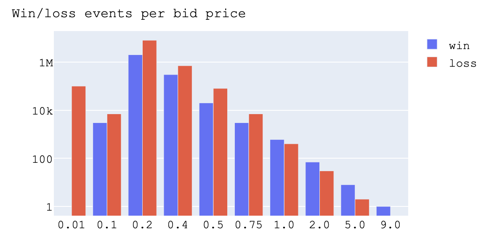
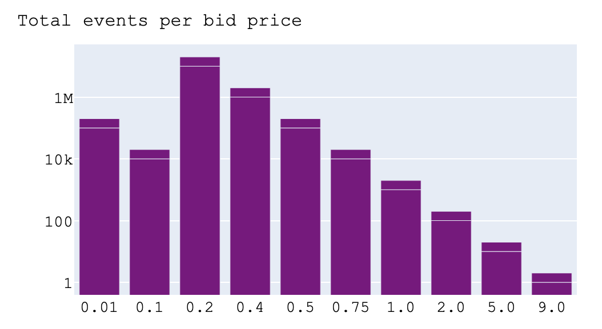
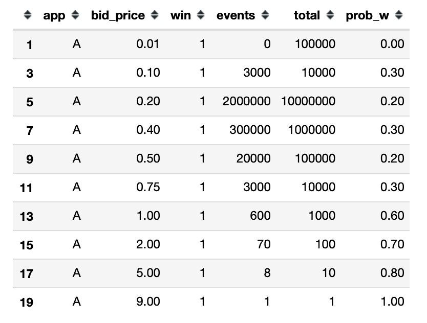
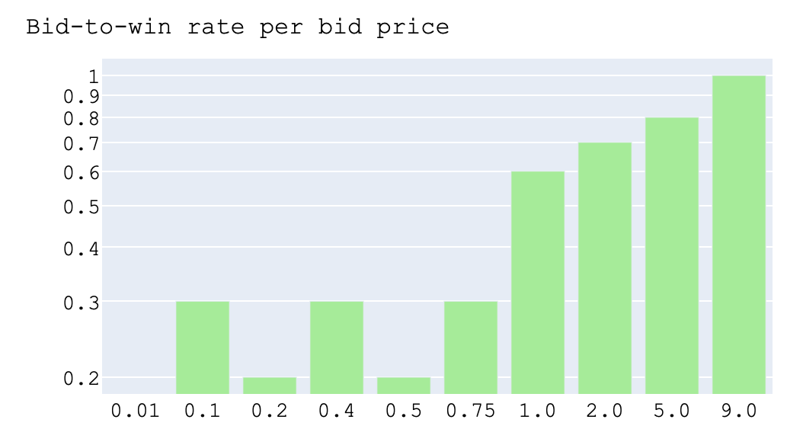
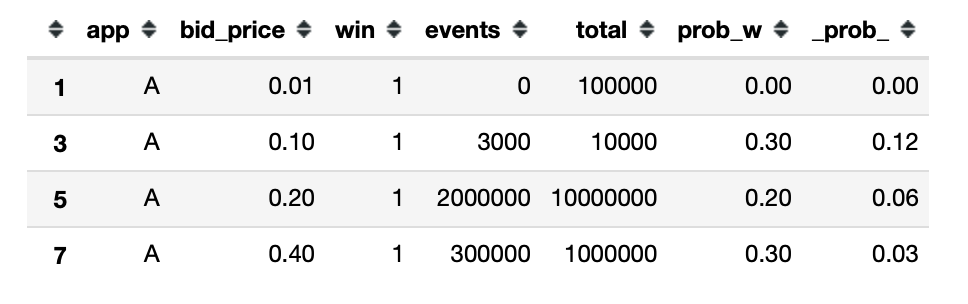

# Data Science Case Study
#### Solutions with calculation details can be found in the [jupyter notebook](https://github.com/jcatlantis/verve_task/blob/057ee6ba6a901d8c87c3741940234ef861a3c78f/analysis.ipynb).

### Load a json file with the data
Some observations resulting form a simple exploratory data analysis (EDA):
- There are not Nones in the data.
- The data only correspond to one app (A).
- There are 10 different bid prices, all greater than 0.
- There is a highly heterogenous sample size (total events for each bid price).

### Visualization of the number win/loss events per bid price
<figure>
    
</figure>

### Adding and visualization of a new column with the total events per bid price (sample size per bis price)
<figure>
    
</figure>

### Problem 1
_Based on Table in above Scenario, estimate the expected win rate for a bid response at a given price (prices are listed in table). State your assumptions clearly and provide the steps on how you arrived at your answer._

<b> Solution </b>

The expected bit-to-win rate at a given bid price is obtained by <b> dividing the number of winning bid events by the total number of events (won + lost) </b>. See the column 'prob_w' (in the table below) with the bit-to-win rate for each bid price, i.e. the probability to win given a bid price __P(win | bid_price)__.

<figure>
    
</figure>

<figure>
    
</figure>

It should be noticed that for some bid prices (e.g. >= 1.0) the sample size is very small (see the second figure), so the results are not statistically significant. Additionally, the obtained bit-to-win rates only represent metrics at a given point in time and for a single app. So, these values can only be generalized under certain assumptions such as the publishers don't change the selection rules and increasing the sample size (i.e. number of events) of each bid price the probabilities of win remain the same.

### Problem 2

_We receive money from our advertisers if we deliver them a win. Lets say that our advertiser is willing to pay \$0.50 per win. This then becomes the upper bound for the bid valuation that we can submit in response to the publisher. For example, if we submit a bid response of \$0.40 and we win, then the advertiser pays us \$0.50, we pay \\$0.40 to the publisher and we made a net revenue of \$0.10._

_If our goal was to maximize net revenue, what is the most optimal bid valuation we should send in our response? Use your estimations from Problem1 and all other available information._

#### Solution

Under the following assumptions:

- The publishers don't change the selection rules in the future.
- The probability of winning per bid_price, __P(win | bid_price)__ as computed in Problem 1, remains the same with increasing sample size (i.e. number of events per bid price).
- There will not be benefits/costs in submitting a certain bid_price over others, that is, every bid_price can be equally placed without any preference or constraint.
- Historical losing/wining bids in other apps are not taken into account.

Then, __the optimal bid_price is \$0.10__, obtained as follows:

- Lets 'advertiser_amount' be the amount that the advertiser is willing to pay per win, e.g. __advertiser_amount = \$0.50__

- The expected profit associated to a certain bid price is: __(advertiser_amount - bid_price) * P(win | bid_price)__

- The bid price that optimizes the expected profit is: __argmax { (advertiser_amount - bid_price) * P(win | bid_price) }__

Thus, it is obtained that (advertiser_amount - __\$0.1__) * P(win | __\$0.1__) is the maximum value (see the table below). 

<figure>
    
</figure>

It should be mentioned that this reasoning can be reproduced to obtain the bid price (which does not have to be the same) that optimizes the expected profit when different values of 'advertiser_amount' are considered.

#### Solution (continued)

It should also be noticed that sample size is significantly heterogeneous between bid prices, with several orders of magnitude of difference. 

Thus, if one of the assumptions above change, that is:
    
- With increasing sample size it can not be guaranteed that the probabilities of winning per bid_price __P(win | bid_price)__ remain proportionally the same.

Then, __the bid price \$0.20 could be the best option__ as it has a significantly larger sample size (so, statistically significant), a bid price not that high being the third offered and the second largest in the table above.
